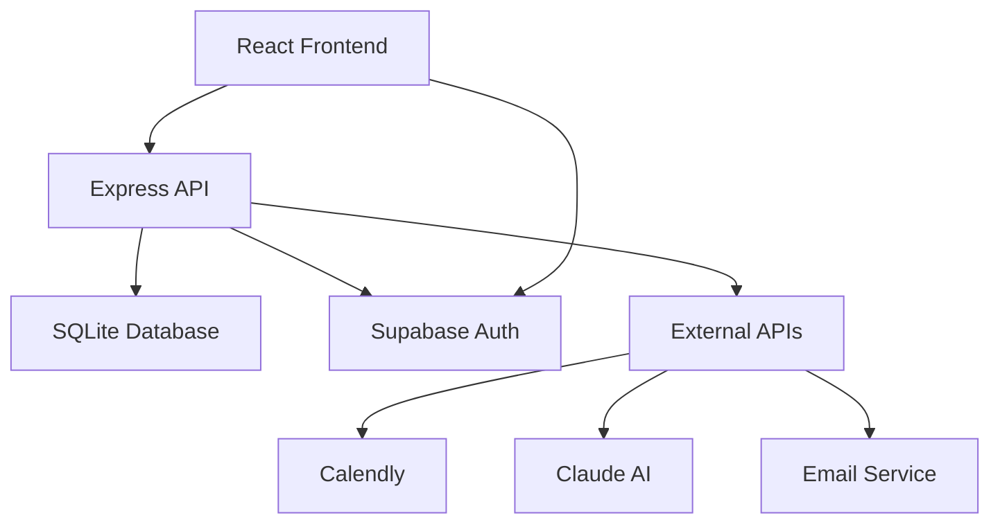

# Career Services CRM 🎓

<div align="center">

[](https://typescriptlang.org/)
[](https://reactjs.org/)
[](https://nodejs.org/)
[](LICENSE)
[](SECURITY.md)

**A comprehensive CRM system for university career services to track student consultations, manage career development, and analyze engagement patterns.**

[Features](#-features) • [Quick Start](#-quick-start) • [Documentation](#-documentation) • [Contributing](#-contributing) • [License](#-license)

</div>

## 🌟 Features

### Core Functionality
- **👥 Student Management** - Complete student profiles with academic and career information
- **📅 Consultation Tracking** - Schedule, track, and manage career counseling sessions
- **📊 Analytics Dashboard** - Comprehensive insights into student engagement and outcomes
- **📋 Note Taking** - Detailed consultation notes with categorization and tagging
- **📈 Reporting** - Export data and generate reports for administrators

### Advanced Features
- **🔐 Secure Authentication** - Role-based access control with Supabase integration
- **🌙 Dark Mode** - Beautiful light and dark theme support
- **📱 Mobile Responsive** - Works seamlessly across all devices
- **⚡ Real-time Updates** - Live data synchronization across users
- **🎯 Smart Filtering** - Advanced search and filtering capabilities
- **🔄 Import/Export** - CSV import/export for bulk operations

### Technical Highlights
- **🛡️ Security First** - Comprehensive security measures and audit trail
- **⚡ Performance Optimized** - Fast loading with intelligent caching
- **♿ Accessible** - WCAG compliant with keyboard navigation
- **🧪 Well Tested** - Comprehensive test coverage with E2E testing
- **📚 Documented** - Extensive documentation and API reference

## 🚀 Quick Start

### Prerequisites
- **Node.js** 18+ 
- **npm** or **yarn**
- **Supabase** account (free tier available)

### Installation

1. **Clone the repository**
   ```bash
   git clone https://github.com/your-username/career-services-crm.git
   cd career-services-crm
   ```

2. **Install dependencies**
   ```bash
   npm install
   cd backend && npm install && cd ..
   ```

3. **Environment setup**
   ```bash
   # Frontend configuration
   cp .env.example .env.local
   
   # Backend configuration
   cp backend/.env.example backend/.env
   ```

4. **Configure Supabase**
   - Create a project at [supabase.com](https://supabase.com)
   - Update environment files with your credentials
   - Run database migrations (see [setup guide](docs/setup/SUPABASE_SETUP_GUIDE.md))

5. **Start development servers**
   ```bash
   npm run dev
   ```

Your application will be available at:
- **Frontend**: http://localhost:5173
- **Backend API**: http://localhost:4001

## 🏗️ Architecture



### Technology Stack

**Frontend**
- React 18 with TypeScript
- Vite for build tooling
- TailwindCSS for styling
- React Query for data fetching
- React Router for navigation

**Backend**
- Node.js with Express
- SQLite for data persistence
- Supabase for authentication
- JWT for session management
- Express middleware for security

**DevOps & Monitoring**
- Playwright for E2E testing
- Sentry for error monitoring
- ESLint + Prettier for code quality
- GitHub Actions for CI/CD

## 📊 Screenshots

<details>
<summary>Click to view application screenshots</summary>

### Dashboard


### Student Management


### Analytics


### Dark Mode


</details>

## 📁 Project Structure

```
career-services-crm/
├── 📁 src/                    # Frontend React application
│   ├── 📁 components/         # Reusable UI components
│   ├── 📁 pages/             # Route components
│   ├── 📁 services/          # API client and external services
│   ├── 📁 contexts/          # React contexts (auth, theme)
│   └── 📁 utils/             # Helper functions and utilities
├── 📁 backend/               # Express.js API server
│   ├── 📁 src/
│   │   ├── 📁 controllers/   # Route handlers
│   │   ├── 📁 models/        # Database models and queries
│   │   ├── 📁 middleware/    # Express middleware
│   │   └── 📁 routes/        # API route definitions
│   └── 📁 data/              # SQLite database files
├── 📁 docs/                  # Comprehensive documentation
├── 📁 playwright/            # End-to-end tests
└── 📁 public/                # Static assets and files
```

## 🛡️ Security

This project takes security seriously. We implement:

- **🔐 Authentication**: Secure JWT-based auth with Supabase
- **🛡️ Input Validation**: Comprehensive server and client-side validation
- **🚫 SQL Injection Protection**: Parameterized queries throughout
- **🔒 XSS Prevention**: Proper data sanitization and encoding
- **🌐 CORS**: Properly configured cross-origin resource sharing
- **⚡ Rate Limiting**: API endpoint protection
- **📊 Security Headers**: Helmet.js for security headers

See our [Security Policy](SECURITY.md) for more details and vulnerability reporting.

## 📚 Documentation

- **[Getting Started Guide](docs/setup/GETTING_STARTED.md)** - Complete setup instructions
- **[API Reference](docs/current/API_REFERENCE.md)** - Comprehensive API documentation
- **[Deployment Guide](docs/setup/DEPLOYMENT_GUIDE.md)** - Production deployment instructions
- **[Contributing Guidelines](CONTRIBUTING.md)** - How to contribute to the project
- **[Security Policy](SECURITY.md)** - Security guidelines and reporting

### Additional Resources
- **[Folder Structure](docs/development/FOLDER_STRUCTURE.md)** - Project organization guide
- **[Authentication Guide](docs/guides/AUTHENTICATION_GUIDE.md)** - Auth setup and configuration
- **[Testing Guide](docs/testing/TESTING_GUIDE.md)** - Running and writing tests

## 🚀 Deployment

### Quick Deploy Options

**Vercel (Frontend) + Fly.io (Backend)**
```bash
# Frontend
vercel --prod

# Backend
fly deploy
```

**Docker Deployment**
```bash
docker-compose up -d
```

**Manual Deployment**
See our [comprehensive deployment guide](docs/setup/DEPLOYMENT_GUIDE.md) for detailed instructions.

## 🧪 Testing

```bash
# Run all tests
npm test

# Unit tests
npm run test:unit

# Integration tests  
npm run test:integration

# E2E tests
npm run test:e2e

# Test coverage
npm run test:coverage
```

## 📈 Performance

- **⚡ Fast Loading**: < 2s initial load time
- **📦 Optimized Bundle**: Tree-shaking and code splitting
- **🔄 Efficient Caching**: Smart API and browser caching
- **📱 Mobile Optimized**: Optimized for mobile performance

## 🤝 Contributing

We welcome contributions! Please see our [Contributing Guide](CONTRIBUTING.md) for details.

### Quick Contribution Steps
1. Fork the repository
2. Create a feature branch
3. Make your changes
4. Add tests
5. Submit a pull request

## 📄 License

This project is licensed under the MIT License - see the [LICENSE](LICENSE) file for details.

## 🙏 Acknowledgments

- **Supabase** for authentication infrastructure
- **Vercel** for hosting and deployment
- **TailwindCSS** for the design system
- **React** ecosystem for the frontend framework
- **Open Source Community** for the amazing tools and libraries

## 📞 Support

- **📧 Email**: support@yourdomain.com
- **🐛 Issues**: [GitHub Issues](https://github.com/your-username/career-services-crm/issues)
- **💬 Discussions**: [GitHub Discussions](https://github.com/your-username/career-services-crm/discussions)
- **🔒 Security**: [Security Policy](SECURITY.md)

## 🌟 Star History

[](https://star-history.com/#your-username/career-services-crm&Date)

---

<div align="center">

**Made with ❤️ for university career services teams worldwide**

[⬆ Back to Top](#career-services-crm-)

</div>